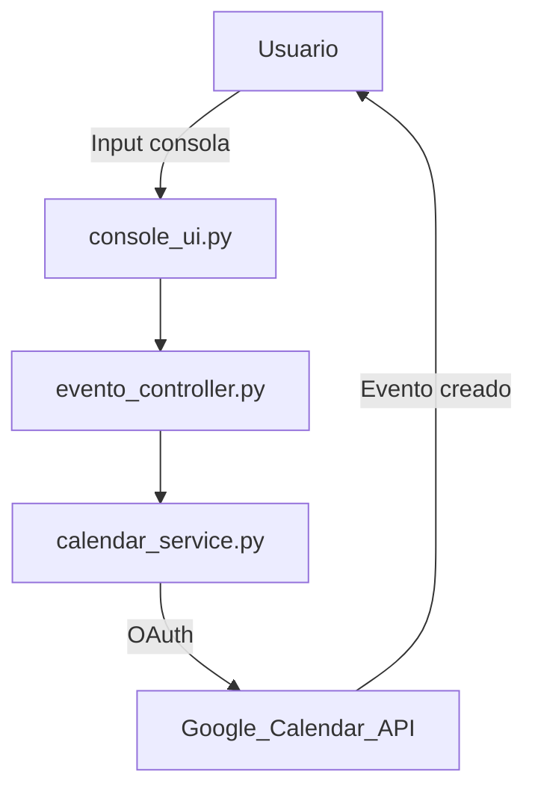

# 🧠 Documentación Técnica: Arquitectura del Proyecto

---

## 📝 Descripción general

Este proyecto es una aplicación de escritorio y futura app móvil, desarrollada en Python, cuyo objetivo es ayudar a gestionar el tiempo personal mediante una integración con Google Calendar. A largo plazo incluirá un asistente inteligente capaz de sugerir acciones, recordar metas, y generar reportes de productividad.

---

## 🏗️ Arquitectura del Proyecto

El proyecto está diseñado siguiendo principios de modularidad, mantenibilidad y escalabilidad. Se basa en una combinación de patrones **MVC (Modelo-Vista-Controlador)** con **servicios desacoplados**, que permiten una evolución hacia aplicaciones móviles y web.

### 🗂️ Estructura de carpetas

```graphql
OrganizadorApp/
├── backend/                      # Lógica del negocio y acceso a APIs externas
│   ├── core/                     # (Futuro) Módulos del asistente, metas, sugerencias
│   ├── services/                 # Conexión a APIs como Google Calendar
│   │   └── calendar_service.py
│   ├── controllers/              # Orquestadores entre frontend y servicios
│   │   └── evento_controller.py
│   └── database/                 # (Futuro) Modelos y conexión con SQLite o Firebase
│
├── frontend/                     # Interfaz de usuario (CLI, escritorio, móvil)
│   ├── desktop/                  # Interfaz de consola (y futura GUI)
│   │   └── console_ui.py
│   └── mobile/                   # (Futuro) Versión Android con Kivy o Flutter
│
├── shared/                       # Utilidades y configuración global
│   ├── config.py                 # Variables de entorno o constantes
│   └── utils.py                  # Funciones auxiliares reutilizables
│
├── credentials/                  # Archivos confidenciales (ignorados por git)
│   ├── credentials.json          # Credenciales OAuth 2.0
│   └── token.pickle              # Token de acceso generado automáticamente
│
├── docs/                         # Documentación técnica
│   └── arquitectura.md           # (Este archivo)
│
├── requirements.txt              # Dependencias del proyecto
├── .gitignore                    # Ignora archivos sensibles y temporales
├── LICENSE                       # Licencia de uso (CC BY-NC 4.0)
├── README.md                     # Documentación general del proyecto
└── main.py                       # Punto de entrada
```

---

## 🧩 Patrones de diseño aplicados

| Patrón           | Uso específico                              |
|------------------|----------------------------------------------|
| MVC              | Organización de módulos (modelo, vista, controlador) |
| Singleton        | Acceso único al cliente de Google Calendar   |
| Adapter (futuro) | Adaptar otras APIs como Google Tasks, Notion |
| Strategy (futuro)| Estrategias de análisis de rendimiento       |
| Observer (futuro)| Actualizaciones reactivas en GUI             |

---

## 🔄 Flujo de creación de eventos



---

## 🔒 Seguridad

- Las credenciales (`credentials.json`) y el token (`token.pickle`) están en una carpeta separada y **excluidos por `.gitignore`**.
- El acceso a Google Calendar se realiza usando **OAuth 2.0**, con permisos mínimos (`calendar`).
- No se guarda información sensible en el código fuente.

---

## 🔮 Proyecciones futuras

- Asistente inteligente que recuerde planes, objetivos y tareas
- Generador de reportes de productividad semanal
- Interfaz gráfica para escritorio con Kivy o PyQt
- Versión móvil Android con Kivy o Flutter
- Sincronización en la nube (Firebase o Firestore)
- Sistema de notificaciones proactivas

---

## 👤 Autor

Desarrollado por **Jhair Zambrano**  
Gregoliana – 2025
